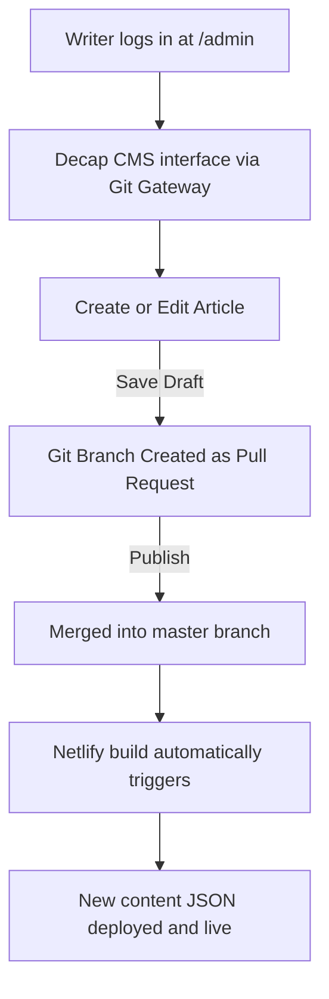

# PrajnaAGI Website — Work Guide & Project Evolution

PrajnaAGI is a premium, highly interactive web platform designed to deliver news, insights, and education on Space (अंतरिक्ष), Science (विज्ञान), Technology (तकनीक), Environment (पर्यावरण), and Health (स्वास्थ्य) in **Hindi**. Founded by Priy Ranjan Pandey (प्रिय रंजन पाण्डेय), the project aims to bridge the language barrier in scientific and artificial intelligence education in India, fostering scientific curiosity and awareness.

---

## 1. Core Purpose & Mission

- **Bridging the Language Gap:** Complex concepts in artificial general intelligence (AGI), astrophysics, quantum mechanics, and biotechnology are translated into clear, accurate, and accessible Hindi.
- **Premium Aesthetics:** Unlike traditional content websites, PrajnaAGI features a state-of-the-art interactive user interface. This includes a custom-coded Canvas gravity orbit simulation, smooth transitions (the Off-White Amaltas design language), and high-contrast dark/light themes.
- **Dynamic Static-File Architecture:** The website utilizes a headless CMS configuration (Decap CMS) connected via Netlify Git Gateway. It reads and writes content in static JSON files, combining the performance and security of static sites with the ease-of-use of a dynamic CMS.

---

## 2. Directory Structure & File References

Here is an overview of the project structure and the role of each reference file:

```
PrajnaAGI Website/
├── .netlify/                      # Netlify local deployment configs
├── admin/                         # Headless CMS Administration
│   ├── config.yml                 # Decap CMS collection schemas & backend rules
│   └── index.html                 # Decap CMS client-side application interface
├── assets/                        # Static assets (styles, scripts, media)
│   ├── css/
│   │   ├── main.css               # Core styling tokens, layouts, & light/dark theme vars
│   │   └── advanced.css           # Styling for Admin Bar, Author Cards, and Video Embeds
│   └── js/
│       ├── canvas.js              # Interactive Solar System & Space gravity warp animation
│       ├── cms-loader.js          # Dynamic JSON content fetcher and DOM injector
│       └── ui.js                  # Shared UI logic (menus, theme toggle, search, forms)
├── content/                       # Database layer (JSON-driven static collections)
│   ├── articles.json              # Main news articles catalog
│   ├── authors.json               # Profile database of editors and content writers
│   ├── facts.json                 # Scientific facts storage
│   ├── nav.json                   # Navigation menu configurations
│   ├── settings.json              # Global site parameters (payments, social handles)
│   └── ticker.json                # Live breaking news headlines
├── netlify/
│   └── edge-functions/
│       └── inject-metadata.ts     # Edge Function for dynamic SEO meta injection
├── scripts/
│   └── generate-index.js          # Historical script for parsing markdown into articles.json
├── 404.html                       # Fallback page for non-existent routes
├── Index.html                     # Homepage
├── about.html                     # Founder, Mission & Vision overview page
├── contact.html                   # Contact form page
├── article.html                   # Dynamic template for reading single articles
├── space.html                     # Space (अंतरिक्ष) category snap-scrolling layout
├── science.html                   # Science (विज्ञान) category page
├── tech.html                      # Technology (तकनीक) category page
├── environment.html               # Environment (पर्यावरण) category page
├── health.html                    # Health (स्वास्थ्य) category page
├── success.html                   # Newsletter submission thank you page
├── thanks.html                    # Support payment confirmation page
├── netlify.toml                   # Netlify configuration & routing definitions
└── robots.txt & sitemap.xml       # Search Engine Optimization configs
```

### Reference File Descriptions

#### 🌐 Core Pages
- **[Index.html](file:///c:/Users/Dell/Downloads/PrajnaAGI%20Website/Index.html):** Entry point. Features a dynamic breaking news ticker, main featured grid (with a progress bar), list of latest articles, newsletter signup, support modals, and background canvas.
- **[about.html](file:///c:/Users/Dell/Downloads/PrajnaAGI%20Website/about.html):** Contains the mission statement, vision, and biography of founder Priy Ranjan Pandey.
- **[article.html](file:///c:/Users/Dell/Downloads/PrajnaAGI%20Website/article.html):** A dynamic template page. On load, it reads the article `id` (or slug) from the query parameters, fetches the articles metadata, renders markdown/text content, embeds YouTube video if `video_id` is supplied, loads the author's card, and generates social share links (WhatsApp/Twitter).
- **[space.html](file:///c:/Users/Dell/Downloads/PrajnaAGI%20Website/space.html):** Employs a custom CSS snap-scrolling mechanism where each section features a single space article layout with a dynamic background image.
- **[tech.html](file:///c:/Users/Dell/Downloads/PrajnaAGI%20Website/tech.html), [science.html](file:///c:/Users/Dell/Downloads/PrajnaAGI%20Website/science.html), [environment.html](file:///c:/Users/Dell/Downloads/PrajnaAGI%20Website/environment.html), [health.html](file:///c:/Users/Dell/Downloads/PrajnaAGI%20Website/health.html):** Classic category-specific grid layouts that dynamically fetch content classified under their respective tags.

#### ⚙️ Data Layer (JSON Database)
- **[content/articles.json](file:///c:/Users/Dell/Downloads/PrajnaAGI%20Website/content/articles.json):** Houses the main articles catalog. Each article contains `title`, `slug`, `category`, `tag`, `author_id`, `date`, `summary`, `body` (in text/markdown), and `image`.
- **[content/authors.json](file:///c:/Users/Dell/Downloads/PrajnaAGI%20Website/content/authors.json):** Mapped author profiles with bio, designation, profile picture, and social links.
- **[content/settings.json](file:///c:/Users/Dell/Downloads/PrajnaAGI%20Website/content/settings.json):** Configuration parameters such as payment details (UPI ID, external PayPal/credit card links), and branding strings.

#### 🖥️ Scripts & Interactivity
- **[assets/js/canvas.js](file:///c:/Users/Dell/Downloads/PrajnaAGI%20Website/assets/js/canvas.js):** Generates a full-viewport canvas background. It features a gravitational warping grid where points are mathematically pulled towards the center, along with an interactive 2D solar system model in Hindi. It also draws the rotating black hole logo on the header canvas `#headerBlackHole`.
- **[assets/js/cms-loader.js](file:///c:/Users/Dell/Downloads/PrajnaAGI%20Website/assets/js/cms-loader.js):** The main controller that fetches JSON database files, parses query variables, manages client-side searches, and renders elements into their respective DOM nodes.
- **[assets/js/ui.js](file:///c:/Users/Dell/Downloads/PrajnaAGI%20Website/assets/js/ui.js):** Handles accessibility features (dark/light theme toggle saved in `localStorage`), mobile navigation drawer, newsletter validations, smooth back-to-top scrolling, and an overlay admin bar that appears automatically for logged-in Decap CMS users.

#### 📡 Netlify & Edge Logic
- **[netlify/edge-functions/inject-metadata.ts](file:///c:/Users/Dell/Downloads/PrajnaAGI%20Website/netlify/edge-functions/inject-metadata.ts):** A crucial server-side script. Since articles are loaded dynamically in the browser via JavaScript, search engine web crawlers and social media preview bots (WhatsApp, Twitter/X) cannot read the correct metadata tags. This edge function intercepts traffic on `/article*`, parses the URL parameters, pulls the exact article from `articles.json`, and injects custom `<title>`, Open Graph (`og:*`), and Twitter Card (`twitter:*`) tags before the response reaches the crawler.

---

## 3. Decap CMS & Content Workflow

The website is integrated with Decap CMS, operating under the `editorial_workflow` configuration to allow drafts, review, and publication.



### Collection Configurations ([admin/config.yml](file:///c:/Users/Dell/Downloads/PrajnaAGI%20Website/admin/config.yml))
1. **👤 Author Profiles:** Updates `content/authors.json` list of authors.
2. **⚙️ Global Settings:**
   - **Navigation Menu:** Updates `content/nav.json` list of links.
   - **Site Configuration:** Updates `content/settings.json` payments, UPI ID, PayPal, and social linkages.
3. **📰 News & Content:**
   - **Articles:** Edits `content/articles.json`. Fields include: Title (Hindi), URL Slug, Author ID, Category selection, Draft/Published status, Cover image, Summary, Main body, YouTube Video ID, and Publish Date.
   - **Ticker:** Updates `content/ticker.json` breaking news ticker lines.

---

## 4. Evolution of the Project

The Git history documents a rich progression of optimization, design harmonization, and user experience upgrades:

### Phase 1: Inception & Layout Standardization (Commits `8a7b5fb` - `69b6f4b`)
- Standardized layout elements and refactored the about page structure.
- Resolved **Mojibake** (encoding corruption) where Devnagari/Hindi text was displaying as gibberish, recreating the index file with proper UTF-8 encoding.

### Phase 2: Metadata & Architectural Foundation (Commits `8c56966` - `5618524`)
- Integrated basic SEO meta tags including Open Graph and Twitter Card tags.
- Implemented modern accessibility enhancements (Search indexing, Back-To-Top button, and dedicated trust pages).
- **CMS Integration:** Transitioned from separate markdown files per article to the unified "Option B" architecture. Decap CMS was configured to write articles, facts, and ticker items into consolidated JSON databases. Created `cms-loader.js` to dynamically load these files client-side, reducing server queries.

### Phase 3: Identity & Subscription Integration (Commits `f0e37eb` - `6a4581c`)
- Injected Netlify Identity Widget across all views to support administrator login and password resets.
- Configured Netlify Forms for the premium subscriber newsletter, implementing proper HTML structure and custom redirects to `success.html` to enhance the premium experience.
- Enabled Decap CMS Editorial Workflow (Drafts) and added advanced media support, allowing writers to attach YouTube video embeds and Twitter links within articles.

### Phase 4: The "Off-White Amaltas" Aesthetic Upgrade (Commits `7d29990` - `d72fad2`)
- Introduced the **Off-White Amaltas** suite — a series of updates centered around universal visual harmonization:
  - **Chromatic Harmony:** Harmonized contrast levels for light/dark mode and aligned text shadows to guarantee maximum readability. The colors were set to a sleek premium dark scheme (black, matte black, and accent gold `#E1AD01`).
  - **Symmetrical Grid:** Deployed a cleaner, compact-spaced grid system.
  - **Smooth Dissolve:** Implemented an intersection observer with a custom fade-in effect on scroll (`.revealed` class in CSS).
  - **Magic Embeds & Links:** Deployed auto-detectors that automatically scale YouTube iframe boxes and style URLs.
  - **SEO & Payments:** Introduced Razorpay/UPI setups, customized sharing bars, and advanced personal SEO parameters.

### Phase 5: Polish & Debugging (Commits `4ee776e` - `5a42642`)
- Cleaned up duplicate functions, unused classes, and structured JavaScript logic.
- Resolved edge case bugs involving:
  - Newsletter submission handlers failing on specific browsers.
  - Invalid relative links in categories like the Space page.
  - Spinner/loaders stuck on payment verification.
  - Double binding on navigation menu lists.
